# Data model

Hand-kept; matches `services/api/alembic/versions/0001_initial_schema.py` (the only DDL).
All timestamps are `timestamptz`, dates `date`, clock times `time`. Enum-like columns carry
a `CHECK` constraint with the spec's values.

```mermaid
erDiagram
    departments ||--o{ doctor_departments : has
    doctors ||--o{ doctor_departments : "belongs to (>=1)"
    doctors ||--o{ schedule_templates : "plans (effective-dated)"
    schedule_templates ||--|{ template_sessions : contains
    doctors ||--o{ schedule_exceptions : "deviates by"
    doctors ||--o{ board_entries : "today, per session"
    doctors ||--o{ appointments : sees
    departments ||--o{ appointments : "booked under"
    appointments ||--o{ appointment_history : "audited by"
    appointments ||--o{ notifications : "impacted -> notified"

    departments {
        text id PK "dept_genmed"
        text code
        text name
        jsonb localized_names "kn, hi, ..."
        bool has_consultant
        bool active
        timestamptz created_at
    }
    doctors {
        text id PK "doc_garima"
        text name
        jsonb localized_names
        jsonb name_variants "fed to the phonetic index"
        text gender "FEMALE | MALE | null"
        text qualification
        int years_of_experience
        jsonb languages_spoken
        numeric fee_amount
        text fee_currency
        bool fee_confirmed "never spoken unless true"
        text attendance_type "REGULAR | VISITING | ON_CALL"
        text booking_policy "BOOKABLE | DESK_ONLY | NO_OPD"
        bool data_confirmed "false caps certainty at EXPECTED"
        bool active
        timestamptz created_at
        timestamptz updated_at
    }
    doctor_departments {
        text doctor_id PK,FK
        text department_id PK,FK
        int position "first = primary department"
    }
    lexicon_entries {
        text id PK "lex_<hash of type|concept|term|lang>"
        text concept_type "DEPARTMENT | DOCTOR | SYMPTOM_ROUTE | RED_FLAG | DAY_PART | SERVICE_TRANSFER"
        text concept_id "dept id, doctor id, DayPart, destination, red-flag label"
        text term "as callers say it, any script"
        text term_normalized "NFC, lower, transliterated to Latin"
        text language
        bool approved "unapproved rows are ignored"
        text source "HOSPITAL | TRANSCRIPT_MINED | AUTO_TRANSLITERATION"
        timestamptz created_at
    }
    schedule_templates {
        text id PK "tpl_<doctor>_<effectiveFrom>"
        text doctor_id FK
        date effective_from "unique with doctor_id"
        date effective_to
        text created_by
        timestamptz created_at
    }
    template_sessions {
        text template_id PK,FK
        text template_session_id PK "tpl_doc_garima_pm"
        int ordinal "the n in ses_<doctor>_<date>_<n>"
        text label
        text_array days_of_week
        time start_time
        time end_time "CHECK end > start"
        text capacity_model "SEQUENCE | TIMED"
        int slot_minutes "TIMED only"
        text capacity_mode "FIXED | PER_HOUR | DEFAULT"
        int capacity_value
        int walk_in_reserve_percent "0..100"
        int last_arrival_offset_minutes
    }
    schedule_exceptions {
        bigint seq PK "identity; creation order; e<seq> for extra sessions"
        text id UK "exc_<hex>"
        text doctor_id FK
        date date_from
        date date_to "CHECK >= date_from"
        text scope "WHOLE_DAY | SESSION | TIME_RANGE"
        text template_session_id
        text effect "UNAVAILABLE | TIME_CHANGE | CAPACITY_CHANGE | EXTRA_SESSION | TIMING_PENDING | TIMING_CONFIRMED"
        time new_start
        time new_end
        int new_capacity
        text reason_category "internal"
        text note "internal"
        text created_by
        int impact_appointments
        int impact_notifications
        timestamptz created_at
        timestamptz deleted_at "withdrawn; ignored by the engine"
        text deleted_by
    }
    board_entries {
        text session_id PK "ses_<doctor>_<date>_<n>"
        text doctor_id FK
        date date "overlaid only when date = today"
        text presence "NOT_ARRIVED | ARRIVING | PRESENT | LEFT"
        time expected_start
        int delay_minutes
        bool session_ended
        text capacity_state "OPEN | FULL"
        int tokens_issued
        time last_arrival_time
        bool timing_confirmed
        timestamptz updated_at
        text updated_by
    }
    appointments {
        text id PK "appt_<hex>"
        text confirmation_code "4 digits; a handle, not a secret"
        text status "BOOKED ... CANCELLED_BY_HOSPITAL"
        text patient_name
        text patient_name_normalized "identity comparison form"
        text phone "contact number, dictated"
        text relation_to_caller
        text caller_number "E.164 network number; staff scope only"
        text doctor_id FK
        text department_id FK
        text session_id
        text slot_id "UNIQUE WHERE status IN live statuses"
        date date
        bool timing_confirmed
        time confirmed_start
        text reason_verbatim "staff scope only"
        text language
        text created_via "AGENT | DESK | WEB"
        text call_id
        text follow_up "NONE | DESK_WILL_CONFIRM_TIMING"
        text impacted_by_exception_id
        timestamptz created_at
        timestamptz updated_at
    }
    appointment_history {
        bigint id PK
        text appointment_id FK
        timestamptz at
        text by
        text change
        jsonb details
    }
    notifications {
        text id PK "ntf_<hex>"
        text appointment_id FK
        text exception_id
        text trigger "SESSION_CANCELLED | SESSION_TIME_CHANGED | TEMPLATE_CHANGED | DESK_MESSAGE"
        text status "PENDING | SENT | FAILED | ACKNOWLEDGED"
        text channel
        text patient_phone
        text patient_language
        jsonb facts "structured, never prose"
        timestamptz created_at
        timestamptz delivered_at
        text delivered_by
        text outcome
        text note
    }
    idempotency_keys {
        text key PK "24 h retention"
        text request_hash "sha256 of method, path, body, caller"
        int status
        jsonb body "stored response; replayed as 200"
        timestamptz created_at
    }
    call_summaries {
        text id PK
        text call_id UK
        timestamptz started_at
        int duration_seconds
        text language
        text caller_number
        text intent
        text outcome
        text transferred_to
        text appointment_id
        jsonb tool_outcomes
        text summary_text
        timestamptz created_at
    }
```



## The one constraint that matters most

```sql
CREATE UNIQUE INDEX uq_appointments_live_slot ON appointments (slot_id)
  WHERE status IN ('BOOKED', 'CONFIRMED_BY_DESK', 'RESCHEDULED', 'ARRIVED');
```

Booking is `INSERT … ON CONFLICT (slot_id) WHERE <live> DO NOTHING RETURNING id`: no row back
means someone else holds the slot → `409 SLOT_UNAVAILABLE`. Rescheduling updates `slot_id`
inside a savepoint; a unique violation rolls back only the savepoint, so the patient keeps
the original slot. Nothing about availability is stored: sessions and slots are computed
per request from `schedule_templates` + `schedule_exceptions` + `board_entries` +
`appointments`.

## Roles

| Role | Privileges | Used by |
|---|---|---|
| owner (`POSTGRES_OWNER_USER`) | owns every table; runs DDL | `healthcare-api migrate` only |
| runtime (`APP_DB_USER`) | `SELECT, INSERT, UPDATE, DELETE` via default privileges; no `CREATE` on `public` | the API process, `seed` |
