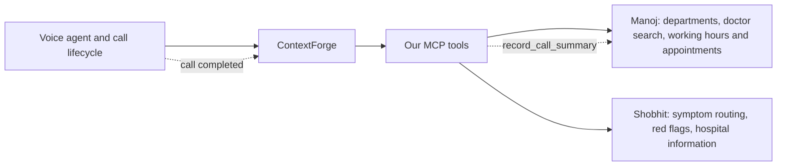

# MCP integration plan with confirmed service ownership

Status: reviewed planning handover; migration implementation has not started. Published 1 October 2026. Start with [the handover README](README.md), [target-state boundaries](TARGET-STATE.md) and [the source audit](CURRENT-STATE.md). The 1 October clarification makes scoped Azure retirement a mandatory completion phase; no cloud deletion is performed by this plan update.

Updated 30 September 2026 from the user's decisions, the [published Manoj contract](https://healthcare-contract-docs.icytree-6543aaa9.centralindia.azurecontainerapps.io/openapi.yaml), and the [Opus review](OPUS-REVIEW.md). This is the current plan, including the actionable review recommendations and the user's callback-only UNKNOWN policy. It supersedes earlier ownership proposals, slot requirements and the direct platform-to-REST summary path. Retirement, rollback and acceptance requirements are included here; the historical investigation is source evidence, not an additional implementation checklist. This is an implementation plan, not a claim of verified production readiness.

Keep the repository and extract in place. Our deliverable is the MCP server and tools consuming Manoj's operational backend and Shobhit's knowledge base. No operational backend, scheduling engine, interpretation engine, knowledge retrieval engine or application database should remain in our production implementation.



The public interfaces are the only dependency on either owner's implementation: keep contract snapshots, client-side types/adapters, configuration and consumer tests; no owner server source, images, database access or local knowledge/operational engines. Each owner builds and hosts their service independently. See [TARGET-STATE.md](TARGET-STATE.md) for allowed repository contents and conversational-tool design requirements.

**Confirmed scope**

| Decision | Integration consequence |
|---|---|
| Slot API is pending; combine working hours with the live board | `GET /doctors/{doctorId}` supplies the usual schedule; `GET /availability` qualifies/overrides it for the requested date and session, analogous to the legacy board_entries role. Do not synthesize slot IDs, capacity, token numbers or available appointment slots. The missing slot endpoint does not block this interim journey. |
| Patient suggests a preferred time; agent creates the appointment | Send the chosen doctor, patient details, visit date and preferred time through the appointment contract. Current API returns NOTED: tell the caller the request was recorded, without promising a reserved time. |
| Rich multilingual date interpretation, ambiguous-name handling and department synonyms will be developed as we proceed | Start with the existing department list, free-text doctor search and explicit calendar dates. No new interpretation endpoint is a prerequisite. Basic caller clarification is sufficient when the returned choices or date are unclear; do not copy the legacy interpretation engine. |
| Shobhit owns symptom routing, red-flag detection and hospital information | Consume explicit routing/emergency/approved-answer results from the knowledge service. Do not ask Manoj to implement clinical routing or retain the old lexical engine locally. |
| Call summaries need an MCP tool | Add a proposed `record_call_summary` tool using `createCallSummary`. Route call finalization through MCP; do not require a separate direct REST writer in the voice platform. |
| UNKNOWN availability means callback details and call summary only | Ask for the caller's name and callback number, tell them someone from the hospital will call back, and save the details in the call summary with outcome CALLBACK_NOTED. No appointment, transfer, alternate booking, notification or separate callback task is created. Applies to today and future dates when the requested availability is UNKNOWN. |

**What the published contract changes**

The Swagger page loads `./openapi.yaml`. The fetched snapshot is [the pinned contract](contracts/manoj-openapi-20260930.yaml), SHA-256 `b8f282718c2c45410dd0dd403369223b9cbe8dea045ee044207aa1e52ec2de78`. It still identifies itself as `0.3.0-draft`, but has 20 paths and 23 operations versus the earlier attachment's 16 paths and 19 operations. Pin the revision/hash during development; the version string alone does not distinguish these contracts.

The additions are `issueMachineToken`, `staffLogin`, `refreshStaffSession` and `staffLogout`, plus authentication schemas and server configuration. The operational request/response schemas have not acquired natural-language date/department interpretation inputs. No slot endpoint was added. The documented `/availability` is a per-session live board, distinct from a slot inventory; its presence in the spec does not establish a running backend implementation.

The server list now distinguishes:

- Azure **contract mock**, `https://healthcare-contract-mock.icytree-6543aaa9.centralindia.azurecontainerapps.io`, with **no `/api/v1` prefix**. It is listed first, so Swagger targets it by default.
- Local backend `http://localhost:8000/api/v1`.
- Local Prism example mock `http://localhost:4010`, also without `/api/v1`.
- A backend Azure hostname that remains a placeholder, with `/api/v1`.

The supplied documentation is reachable. No operational or mutation endpoint, credentials, backend readiness or production latency was tested. The mock's existence is useful for development, but is not evidence of stateful backend behavior.

For MCP machine authentication, use `POST /auth/token` relative to the configured API server, form-encoded `grant_type=client_credentials`, authenticating with HTTP Basic or body client credentials as documented. Scope is granted at client registration; the request's `scope` field is ignored. Cache the returned token using `expires_in`, refresh by obtaining another machine token, and keep credentials separate for Manoj and Shobhit. Staff login/refresh/logout must not become caller tools or be used to bypass missing machine permissions. Register only the required operational and call-summary permissions; use a separate tool credential for `calls.write` if desired to isolate access.

Use the full configured base URL without legacy `/api/v1` stripping. Test construction of token and operation URLs for both backend and no-prefix mock. Maintain a persistent client and independent pool/timeouts for each service. Cache tokens per tenant/client/service, refresh before expiry with a safety margin, and allow only one concurrent refresh. On a genuine authentication rejection, invalidate and refresh once only if the remaining operation deadline permits; retries of mutations retain the same operation key and payload. Never request staff scopes to bypass a failure.

`/health` checks the MCP process. `/ready` checks local configuration and initialized components; do not perform a fresh token request or require an undocumented downstream `/ready` on every probe. Report each dependency's health separately using bounded background checks and agreed authenticated operations. Release smoke tests must still verify actual external reads; local readiness alone is not a release pass. A knowledge dependency failure affects tools that need its routing decision, without stopping MCP from returning accurate failure results or finalizing summaries through a working operational service.

**Interim working-hours journey**

1. For an availability or appointment-create request, obtain the original utterance, language and relevant turn context from the trusted voice-platform context. MCP always obtains Shobhit's routing decision for that context before presenting routine scheduling results or dispatching a create; it does not decide locally whether the text contains symptoms. The check is an internal service call, not dependent on the LLM explicitly choosing `search_knowledge`. Independent directory/board reads may overlap the check. Shobhit's emergency/desk/clarification outcome takes precedence over entering a routine booking journey; only a response permitting that journey allows it to continue. Missing context, an unknown response shape or unavailable routing must not be treated as clearance. This is orchestration, not local detection logic.
2. Call `listDepartments` (`GET /departments`) to obtain department names and IDs, and `searchDoctors` (`GET /doctors?query=...`) with the doctor's name as heard. Use the returned IDs for follow-up requests. If several doctors match, ask the caller which one; if a department phrase cannot be matched confidently to a returned name, clarify. Specialized synonym, phonetic and multilingual matching is deferred, not a prerequisite for using these endpoints.
3. For a resolved doctor and requested date, obtain `getDoctor` (`GET /doctors/{doctorId}`) and `getAvailability` (`GET /availability?doctorId=...&date=...`). These reads can run in parallel once their inputs are known. Use the literal `today` when the request is for today, or the confirmed ISO date. Preserve all usual-schedule windows (`daysOfWeek`, `start`, `end`, optional `label`) and all per-session board rows. A missing usual schedule does not invalidate a confirmed board entry, including an ON_CALL doctor's entry.
4. Present the usual schedule together with the board's date/session-specific status. Current board timing/status takes precedence over routine hours: IN can support a current attendance statement, LATE reports the supplied revised expectation, CANCELLED means that session is cancelled, and NOT_CONFIRMED/UNKNOWN must remain unconfirmed/unknown. For UNKNOWN, including stale/missing entries represented as UNKNOWN by Manoj, stop the appointment flow: ask the caller's name and callback number, tell them someone from the hospital will call back, and save only a call summary. Do not transfer, create an appointment, offer an alternate booking or launch any other action for this fallback. Apply expectedEndTime expiry and keep each session distinct; a morning confirmation says nothing about evening. This is consumption of backend facts, not recreating its scheduling engine.
5. Read back the patient's preferred date/time and details. Use a confirmed explicit calendar date formatted as `YYYY-MM-DD` and local time as `HH:MM` in `AppointmentCreate`, with `doctorId`, `patientName`, `mobile`, `visitDate`, optional `expectedTime` and unchanged `reasonVerbatim`. Inject trusted `callId` and an idempotency key. ISO dates are an ordinary wire format, not a contract defect. Until richer spoken-date handling is designed, ask for an explicit day/month/year or clarification rather than silently guessing ambiguous or relative dates.
6. On a valid success, state that the request is recorded with that preferred time. On timeout after submission, state uncertainty rather than claiming that it failed or succeeded. No fake slot or `BOOKED` equivalence is introduced.

Working hours spanning multiple sessions or two hours remain complete windows. A caller's preferred time is an expectation, not proof of capacity. Validation of appointment dates, allowable times, doctor changes and any future slot allocation belongs to Manoj. Do not build these operational rules into the stub or MCP.

Steps 5–6 apply only when continuing the appointment journey; UNKNOWN takes the callback-only branch instead. This user-selected policy supersedes both the earlier desk-handoff proposal and Opus's suggestion to permit a NOTED appointment for UNKNOWN. It changes the consumer policy in the plan without editing Manoj's supplied specification. A transport failure remains a service error and must not be silently relabelled as a valid UNKNOWN board response.

The live board acts as a status/timing overlay, not merely a filter that removes rows. Keep cancelled and unknown sessions visible in the structured result so the agent can explain them. Prefer supplied expectedTime/expectedEndTime for the specific board session without adding delayMinutes again to a possibly already revised time. Do not infer a missing end time or join ambiguous session labels arbitrarily. On board failure, report that current status could not be checked; do not turn standard hours into a successful current-availability answer. Tests should distinguish normal, late, cancelled, unconfirmed, unknown/stale, expired, multiple-session and on-call cases. The slot API remains a separate future capability.

```mermaid
sequenceDiagram
  participant V as Voice agent
  participant M as MCP through ContextForge
  participant O as Manoj backend
  participant K as Shobhit knowledge service
  V->>M: get_doctor_availability plus trusted original turn context
  par Routing for every availability request
    M->>K: Agreed routing contract
    K-->>M: Routing decision or explicit service failure
  and Independent directory lookup when inputs permit
    M->>O: searchDoctors query or listDepartments
    O-->>M: Directory records with names and IDs
  end
  alt Routing requires escalation, clarification or is unavailable
    M-->>V: Required routing or failure outcome; no routine appointment
  else Routing permits routine journey
  opt Several matches or unclear department
    M-->>V: Returned choices for caller clarification
    V->>M: Caller-selected target
  end
  V->>M: Requested date, today or confirmed ISO date
  par Independent reads after doctor and date are known
    M->>O: getDoctor with resolved doctor ID
    O-->>M: Usual working-hour sessions
  and Live board for requested date
    M->>O: getAvailability with doctorId and date
    O-->>M: Per-session status and timing updates
  end
  alt Requested availability is UNKNOWN
    M-->>V: Callback-only outcome
    V->>V: Ask caller name and number; say someone will call back
    V->>M: record_call_summary at call completion
    M->>O: POST /call-summaries, outcome CALLBACK_NOTED
    O-->>M: Stored summary
  else Continue appointment journey where appropriate
    M-->>V: Working hours qualified by board status, no slot claims
    V->>V: Confirm preferred time and patient details
    V->>M: manage_booking create plus current trusted context
    M->>K: Routing check including any new caller information
    K-->>M: Routing decision
    alt Routing permits creation and caller confirmed
      M->>O: POST /appointments with stable operation key
      O-->>M: Appointment with status NOTED
      M-->>V: Request recorded, preferred time not reserved
    else Routing blocks routine creation
      M-->>V: Required routing or failure outcome; no appointment write
    end
  end
  end
```

For “any physician tomorrow,” use the department list to establish the requested department and obtain its ID, clarifying the name with the caller if needed. List that department's doctors and let the caller select when necessary; do not independently rank clinical suitability. Confirm an explicit calendar date if relative-date handling is not yet implemented. Fetch the department's board with `GET /availability?department=...&date=...` rather than one board call per doctor; pass exactly one of department or doctorId. Directory/profile reads for already identified candidates may run in bounded parallel with the board request. Don't return only the first few doctors/windows as though complete.

Configure the facility's IANA timezone and inject a controllable clock for tests. Use the full board date plus local time for expiry; a future session is not expired merely because its clock time has passed today, and a past entry is not current attendance. Confirm weekday selection in facility time around midnight. Qualify `DoctorDetail.dataConfirmed=false` data as unconfirmed; missing optional confirmation metadata is not proof of approval. Never use `patientsPerHour` to allocate capacity or derive patient arrival times.

One `get_doctor_availability` invocation composes directory search, profile, board and the required routing check internally. It returns a complete result or clarification choices. The diagram's caller-clarification branch represents a genuine additional conversation turn, not separate model-facing search/profile tools. Facility clock handling and formatting explicit dates are basic adapter responsibilities; richer spoken-date/name/synonym interpretation remains deferred.

**Planned MCP tool surface**

| Tool | Consumer contract | Change |
|---|---|---|
| `get_doctor_availability` | Manoj department list, free-text doctor search, doctor profile and live board | User-selected name, replacing the proposed `get_doctor_working_hours`. Replace the legacy `find_availability` tool during implementation. Return working hours qualified by date/session-specific live-board status. Slot availability is not yet supported. |
| `manage_booking` | Manoj create/list/cancel/reschedule operations | Replace slot/newSlot inputs with target/date/preferred time as supported by each operation. Keep identity protections and honest lifecycle status. No need to settle a new action name before contract design. |
| `search_knowledge` | Shobhit interface, pending | One planned tool covers symptom routing, emergency/desk escalation and hospital answers. Its downstream endpoint and payload remain pending Shobhit's contract. |
| `record_call_summary` | `createCallSummary`, `POST /call-summaries` | New required MCP tool. Expose to the authenticated agent lifecycle; no summary listing or staff tools implied. |

The initial plan has four MCP tools. Update tool discovery assertions, registration's hard-coded tool list, release smoke expectations and LiveKit's cached schemas/instructions during implementation. These are planning decisions; the production code has not yet been renamed or adapted.

**Trusted caller identity and appointment access**

Keep patient contact separate from caller authorization. Create accepts the dictated/read-back patient name and contact mobile; those fields do not establish authority to view or change existing appointments. LIST, CANCEL and RESCHEDULE must derive `mobile`/`callerMobile` from authenticated, tenant-bound platform context at the agreed verification level. Remove the legacy model-visible LIST phone override; model fields cannot set caller headers, tenant, authorization basis or idempotency keys. Bind forwarded context to the actual call and isolate concurrent callers.

Normalize verified phone context using an explicitly configured supported country rule and validate the contract's ten-digit Mobile field. Do not strip arbitrary prefixes or take the last ten digits. A trusted SIP caller-number header alone is not universal proof of ownership; the platform and Manoj must agree what verification the authenticated MCP consumer is asserting. Web/WhatsApp integrations must supply their own authenticated channel context under that same policy.

For the initial release, absent verification, unsupported numbers and requests to manage an appointment under another person's number cannot trigger a lookup or mutation using a dictated substitute. Return a neutral identity-unavailable/not-found result as appropriate and use the established assistance flow; do not implement delegated-family authorization locally. This restriction does not prevent creating a request with an authorized patient's dictated contact information. Define broader family access with Manoj/platform separately. Minimize returned appointment details and never expose symptom text, other contacts or raw upstream errors merely to select an appointment. The UNKNOWN callback flow remains summary-only; its caller-provided callback number is contact data, not authorization.

**Mutation identity, retries and response validation**

The platform supplies a trusted logical operation ID for each confirmed create/cancel/reschedule intent. MCP derives an opaque key of at most 64 characters bound to tenant, call, action, target and that operation ID. Freeze the exact outgoing body for that intent; backend replay compares it against the same key. Repeated model/network attempts for one pending intent must reuse both. A body hash may detect changes, but must not silently mint a new operation after a lost response.

Corrections before dispatch can replace the pending payload. After a definite rejection, a corrected request is a new explicit intent. After possible commit/UNCERTAIN, reconcile the original operation before deciding whether a correction requires rescheduling, cancellation or a new request. Rephrasing a name/reason is not sufficient evidence that the caller intended another appointment. Keep operation context in the platform's call lifecycle, not a new MCP database. Missing trusted call/operation context refuses the mutation locally; do not rely on Manoj rejecting an optional idempotency key.

Use explicit consumer outcomes that distinguish validated success, definite validation/auth rejection, state conflict, idempotency conflict and uncertain write completion. The final envelope names are an MCP schema choice; do not change Manoj's statuses. Do not claim success for a malformed 2xx body, or definite failure after an ambiguous post-send timeout. A replay response describes the original write and may need current-state checking after later changes. A list-by-mobile is not guaranteed to identify a particular lost write uniquely.

Apply one total deadline covering pool wait, OAuth, all downstream calls and any retry. Remove the legacy unconditional timeout/504 retry. Permit at most one same-key retry within the remaining turn budget when the owner's replay semantics make it safe; otherwise return an uncertain or unavailable outcome promptly. Do not sleep through Retry-After during the voice turn or multiply retries across gateway/MCP/platform layers. Finalization retries outside the voice turn keep their original operation identity and fixed payload. Agree replay TTL, scope and atomic commit/result persistence with Manoj before claiming recovery guarantees.

Validate successes and errors at each service boundary. Preserve optional fields as unknown; map known error codes into minimal MCP outcomes, and keep raw error prose/PII out of model output and logs. Failure or malformed data is not an empty successful availability result. Correlate logs with opaque call/operation IDs and timing, not phone query strings, patient names, reasons or credentials.

**MCP tools mapped to downstream REST endpoints**

Paths below are relative to the configured service base URL. Manoj's documented backend uses `/api/v1`; the published Prism mock has no `/api/v1` prefix. Directory calls are conditional on the caller's input and known IDs. Profile and board reads can run in parallel once the doctor/date are known; cached profile data may avoid a repeat profile request, but current board status must remain fresh.

| MCP tool/action | Owner | REST endpoint | Purpose |
|---|---|---|---|
| `get_doctor_availability` — department lookup | Manoj | `GET /departments` (`listDepartments`) | Obtain department names, IDs and staffing state. |
| `get_doctor_availability` — doctor search | Manoj | `GET /doctors?query=...` and/or `department=...` (`searchDoctors`) | Find doctor records and IDs; optional gender filter where requested. Clarify multiple matches. |
| `get_doctor_availability` — doctor details | Manoj | `GET /doctors/{doctorId}` (`getDoctor`) | Read `usualSchedule` for working-hour sessions and requested profile information. |
| `get_doctor_availability` — live board | Manoj | `GET /availability?doctorId=...&date=...` or `GET /availability?department=...&date=...` (`getAvailability`) | Qualify/override usual hours with date/session-specific attendance, delays, cancellations, unconfirmed/unknown state and expected timing. Exactly one target filter per call. |
| `manage_booking` — create | Manoj | `POST /appointments` (`createAppointment`) | Record patient details, doctor or department, visit date and optional preferred time. Success is NOTED, not a reserved slot. |
| `manage_booking` — list | Manoj | `GET /appointments?mobile=...` (`findAppointments`) | Retrieve appointments for the authorized number; optional from/to/status filters. |
| `manage_booking` — cancel | Manoj | `POST /appointments/{appointmentId}/cancel` (`cancelAppointment`) | Cancel using trusted caller identity and the documented request fields. |
| `manage_booking` — reschedule | Manoj | `POST /appointments/{appointmentId}/reschedule` (`rescheduleAppointment`) | Change visit date and optional preferred time; no new doctor/department field is currently specified. |
| `search_knowledge` | Shobhit | Endpoint pending | Hospital information, symptom routing and red-flag decisions through Shobhit's service. |
| `record_call_summary` | Manoj | `POST /call-summaries` (`createCallSummary`) | Store the completed call's summary, with callId replay protection. |

Shared transport calls `POST /auth/token` (`issueMachineToken`) for Manoj machine credentials when a cached token needs obtaining/renewing; it is not another MCP tool and need not run on every tool call. Shobhit authentication remains separately configured according to his contract. `GET /availability` is included in the initial tool as the live-board overlay. It does not enumerate reservable slots; the pending slot endpoint will be integrated separately when available. The plan still has four MCP tools.

**Call-summary tool contract proposal**

The REST endpoint already exists in the published contract. Required fields are `callId`, `startedAt`, `intent` and `outcome`; optional fields are `durationSeconds`, `language` (EN/KN/HI), `callerMobile`, `transferredTo`, `doctorId`, `appointmentId` and `summaryText` (maximum 500 characters).

For the confirmed UNKNOWN callback flow, set `outcome=CALLBACK_NOTED`, put the caller-provided callback number in `callerMobile`, and include the caller's name and the requested doctor/date with the UNKNOWN reason in `summaryText`. There is no structured caller-name field in this contract, so do not invent one. Use the actual call intent (for example AVAILABILITY), trusted call metadata and known doctor ID where applicable. Omit `appointmentId` and `transferredTo` for this callback-only outcome. Suggested spoken wording: “May I have your name and callback number? Someone from the hospital will call you back.” Do not invent a callback deadline. Persist through `record_call_summary` only; no separate callback record, scheduling mutation or outbound-notification action. A failed summary write is not a successful saved callback request.

Acceptance check: for today's or a future requested session with UNKNOWN, including stale/missing cases returned as UNKNOWN, collect the name/number and send exactly the call-summary business write with CALLBACK_NOTED. Assert no appointment mutation, transfer, alternate booking or separate notification/task. Retry a lost summary response safely using the same finalized payload and callId.

Proposed model/lifecycle inputs include final intent/outcome, brief summary and relevant target IDs. Inject authoritative callId, start time and measured duration from platform call context, not invented model values. The platform must make this metadata available during finalization, even after the caller disconnects; additional trusted headers/context will need gateway allowlisting and tests. Keep `callerMobile` optional and follow the contract's “only when the caller gave it” rule rather than copying caller ID automatically.

Recommend invoking this tool from the call-completion lifecycle, outside the one-second customer-response path. The result is stored with `calls.write`. The API promises 201 for a new summary and 200 for an existing callId, returning the original unchanged. Therefore do not post a provisional summary mid-call and expect later retries to update it. Stable, tenant-bound call identity, idempotent retry and an observable finalization queue should live in the platform's lifecycle infrastructure; MCP remains stateless and does not add a persistence backend.

The MCP server has four tools, but ordinary in-call model selection must not be able to finalize an irreversible summary prematurely. Configure and verify separate conversational versus authenticated call-end access using the gateway/platform's supported tool filtering or equivalent lifecycle restriction. The platform invokes `record_call_summary` programmatically after the call; no fifth tool or separate REST writer is required. Verify the actual gateway mechanism rather than assuming a visibility feature exists.

Construct the complete final payload once from authoritative lifecycle metadata and observed actions, then retain that identical body for retries. Do not recompute duration, wording or timestamps on every attempt. Use the endpoint's documented callId deduplication; if also sending Idempotency-Key, bind it to the same finalized summary and confirm precedence with Manoj. Start time/duration/verification context must travel through authenticated, allowlisted metadata and remain available after disconnection.

For abrupt hang-up, retain a known completed outcome such as APPOINTMENT_NOTED or CALLBACK_NOTED when justified by the call record; use ABANDONED only when the observed journey warrants it. Use OTHER for genuinely unknown intent. Map supported language tags to EN/KN/HI, otherwise omit the optional language field. Produce a complete summary within 500 characters, preserving callback name/context when required; never silently drop essential callback details by arbitrary truncation. The platform owns eventual retry/failed-finalization monitoring; MCP does not create an outbound callback task or notification for UNKNOWN.

Validate the success body before acknowledging storage. Derive returned status such as stored/replayed from verified HTTP/result data; errors/timeouts must not be reported as success. Do not send transcripts/audio, and do not expose staff-only summary read endpoints. Test normal storage, same-call replay, dropped response after commit, malformed data, wrong scope and failure without delaying patient speech.

**Shobhit integration requirements**

The knowledge contract needs explicit machine-readable outcomes for at least emergency transfer, desk transfer, clarification, approved department routing, permission to continue the routine journey, approved hospital answer, no answer and service failure. These are requirements for contract discussion, not invented current endpoint fields. A hospital-information no-answer is not interchangeable with a successful routing check that permits routine scheduling.

For symptom routing, carry original utterance and language, preserve approved department references and clarify their mapping to Manoj's tenant directory. Shobhit decides the route; Manoj supplies operational department identity and staffing truth. `hasConsultant=false` must still prevent a claim that a consultant is offered. Do not reinterpret a knowledge answer as an operational promise.

For red flags, test mixed-language symptoms, a named-doctor request containing a danger sign, negation/ambiguity and missing/slow knowledge responses. The initial implementation defaults to no routine scheduling result or appointment creation without a valid required routing response; return a routing-service-unavailable outcome for the agent's established assistance handling. The precise caller-facing outage handling remains a Shobhit/product contract item before cutover. Do not build a local classifier to decide a request is safe to bypass the check. Read-only prefetch may complete, but its success must not hide the unavailable check. Knowledge failure must not prevent a previously finalized call summary from being stored through an otherwise working Manoj service. A valid UNKNOWN board response after the routing gate uses the user's callback-only rule, never a transfer substituted for that rule.

For hospital information, return approved speakable text, language and provenance, with explicit no-answer/clarification handling. No model-invented medical advice or translation of approved text is added in MCP. No knowledge service interface or live implementation was supplied in this turn.

**Published-contract validation and remaining engineering gaps**

Structural validation now finds four invalid component schemas caused by five unquoted inline descriptions containing commas:

- `CallSummaryCreate.properties.doctorId` and `.appointmentId`, lines 1208–1209.
- `Error.properties.error.properties.message`, line 1235.
- `ClientCredentialsGrant.properties.scope`, line 1256.
- `LoginResponse.properties.role`, line 1278.

Quote these descriptions or use block scalars in a Manoj-owned revision. All 25 discovered inline typed examples passed schema/format validation, but that does not make the full document valid. The contract was not edited.

For development, prefer a corrected owner-published contract. If that is not yet available, use an explicitly labelled test-only overlay containing the five quoting corrections, with source and overlay hashes; leave the downloaded original unchanged. Do not add guessed endpoint semantics to that overlay. Mark behavior fixtures based on unconfirmed assumptions separately and run the same consumer assertions against Manoj's designated test tenant when available. Neither Prism examples nor a stateful stub proves the owner's authorization, replay, scheduling or performance behavior.

Other earlier engineering gaps remain: exactly-one doctor/department is prose-only; trusted caller authorization differs from dictated mobile; family/delegated access is unspecified; appointment replay retention/scope/current-state semantics need agreement; health/error/rate-limit contracts are incomplete. These should be tracked collectively, not asked as a batch of user questions. Missing slots are explicitly deferred and are not a blocker for working-hours plus preferred-time requests.

The user has resolved the earlier interpretation-interface question for current planning: use the department endpoint to obtain IDs, use free-text doctor search as supplied, and develop richer interpretation as we proceed. ISO dates, department IDs and free-text queries are not blockers or reasons to require a new endpoint. Track advanced language/ambiguity behavior as deferred work; the interim flow uses returned directory choices and confirmed explicit dates. The legacy backend's interpretation code is historical evidence, not a requirement to preserve it in the new integration.

**One-second response budget and measurement**

Distinguish tool dispatch-to-result (including gateway and downstreams) from speech-end-to-useful-audio. The provisional 70 ms adapter/transport plus 180 ms downstream budget targets about 250 ms for the tool portion. Merely returning a tool within 500 ms does not guarantee a one-second caller response. Apply [the model-facing tool and measurement requirements](TARGET-STATE.md); no extra LLM, embedding or local engine belongs in MCP.

Measure end of caller speech to first audible useful result at the caller. Filler acknowledgement is reported separately. Measure clarification turns separately from completed availability/appointment journeys. The target percentile and load must be agreed before performance acceptance; proposed initial target is p95 <=1,000 ms under declared supported load, with cold-start and failure rates reported rather than excluded silently.

| Stage | Provisional allocation |
|---|---:|
| Endpointing and residual STT | 150 ms |
| Model selects tool/arguments | 150 ms |
| Gateway, MCP orchestration and transport | 70 ms |
| Downstream critical path, including the required routing decision | 180 ms |
| Model produces useful answer | 180 ms |
| TTS start and media playout | 170 ms |
| Headroom | 100 ms |
| Total planning allocation | 1,000 ms |

These allocations are engineering hypotheses, not measurements or a proof obtained by adding stage percentiles. Derive an absolute tool deadline from the remaining turn budget, reserving response/TTS time, and measure the complete journey directly. Availability may require doctor search followed by parallel profile/board reads while Shobhit evaluates the trusted turn. Known IDs and valid cached profile data remove directory hops; the fresh board and applicable routing decision still remain. A creation must wait for its current routing decision and confirmation before its write.

Cache tenant-bound department/profile data with bounded TTL and agreed invalidation; cache neither live-board truth across turns nor a routing clearance across changed caller information. Preserve persistent connections and warm OAuth tokens. Bound directory pagination and profile fan-out; show incomplete results explicitly rather than claim no match. Keep one model-facing availability invocation for the internal composition. Add an early latency spike as soon as the real service hosts exist, from the intended MCP region; if the downstream critical path cannot fit, discuss service placement or owner-provided aggregation then, not speculative aggregation endpoints now.

Measure p50/p95/p99 with cold/warm token, DNS/TLS, process/model state, English/Kannada/Hindi inputs and realistic concurrency. Trace call/turn/operation IDs through speech end, gateway/MCP spans, downstreams, model response and first audible result without logging patient data. Inject latency/errors in stubs to verify deadline behavior, then measure real Manoj/Shobhit/gateway/voice paths. Contract-mock timing is not production evidence. Call summaries and their retries run after the call, outside this budget.

**Updated development and retirement phases**

| Phase | Concrete implementation work | Exit gate |
|---|---|---|
| 1. Consumer contracts and boundaries | Pin the operational spec and quoting-only correction process; define the four MCP input/output envelopes, trusted call metadata, timezone, mutation identity and summary lifecycle. Record Shobhit's pending interface separately. Carry forward the UNKNOWN callback decision. | Enough consumer contract detail for implementation tasks; no slot or advanced interpretation prerequisite. External assumptions labelled. |
| 2. Independent test foundation | Separate dev/test operational and knowledge stubs; MCP contract snapshots; backend-free runner/CI job. Operational fixtures cover directory, profiles, session board, appointment lifecycle, auth and summaries. Knowledge fixtures cover routing/answers/failure. Controlled clocks and commit-then-drop-response cases; no engines or PostgreSQL. Start real-host latency spike when hosts arrive. | Mandatory integration tests run without API source/virtualenv/database. Missing specs or accidentally skipped required suites fail. Provisional knowledge fixtures are not represented as an agreed production contract. |
| 3. MCP and platform integration | Adapt tools/config/server/prompts; independent clients/auth; identity and routing gates; deadlines/replay; programmatic call-end summary. Update gateway discovery, tool access and context forwarding. Coordinate changing default CI/tests with repointing the adapter. | Four tool contracts verified through MCP HTTP and stub journeys; ordinary model tool selection cannot finalize a call early. |
| 4. External verification | Run the same consumer suite against designated owner test services; verify actual gateway schema refresh/header isolation, lifecycle persistence, synthetic lifecycle writes and real voice latency. | Agreed contracts/auth/caller verification and callback-summary workflow exercised; one-second metric measured under stated conditions. Safe degradation and no false success demonstrated. |
| 5. Cutover and complete source retirement | Canary compatible MCP/gateway/prompt versions, keep one appointment authority, verify required data handoff, remove all legacy source/tooling and update documentation. | Clean checkout installs/builds/tests/deploys MCP without the legacy API, its environment, PostgreSQL, migrations or seed/apply jobs. Rollback path verified. |
| 6. Azure retirement and closure | Refresh the [resource inventory](AZURE-RETIREMENT.md), resolve shared ownership/data retention, retire obsolete API apps/jobs/images/database assets/secrets/grants after cutover, and remove exclusively obsolete resource groups. Preserve or relocate required shared consumers before removing parent resources. | No unexplained old backend resources or active references remain; retained shared resources have an owner/purpose, retained data has an agreed disposition, MCP/voice smoke passes and residual cost is reviewed. Code removal alone is not completion. |

Keep any temporary legacy test profile explicitly named during migration. The new default tests must not silently skip contract coverage because `services/api` or the old OpenAPI disappeared. Add the new independent path before removing the old one; switch active CI and deployment in step with the adapted tools. Stubs must be dev/test-only, excluded from the production image, and must not be accepted as production downstream configuration.

**Prompt and gateway migration**

Rewrite `prompt.py` and the healthcare pack around board-qualified working hours, clarification, CALLBACK_NOTED and truthful appointment states. Remove slotId/newSlotId, capacity/confirmation-code promises and obsolete timingCertainty/outcome branches. CONFIRMED_BY_DESK can be described as desk acknowledgement; it still does not mean a guaranteed time under Manoj's contract. Include explicit instructions for missing identity, routing failures and uncertain mutations.

Replace the old three-tool discovery expectations with the four planned names, versioned schemas and instructions. `register.py` currently treats matching registration metadata as a no-op; change the workflow to verify/refresh actual tool schemas and instructions, not merely registration name/URL. Verify the supported ContextForge refresh and lifecycle-access controls and refresh LiveKit's cached tool view together. Test concurrent-call header isolation and refusal of model-provided trusted fields. Production smoke checks auth, discovery, expected read-only results and appropriate dependency status; it must never create an appointment or summary just to pass a release check. Synthetic mutation/lifecycle tests run only against designated test tenants.

**Active repository retirement inventory**

| Disposition | Files/surfaces | Required result |
|---|---|---|
| Keep/adapt | `services/mcp/src/frontdesk_mcp/{tools,config,server,prompt,packs}.py`, `packs/healthcare.json`, CLI, pyproject/lockfile, Dockerfile and README | Standalone four-tool adapter with no backend imports, SQL stack, retrieval or interpretation engine. Preserve protocol/security/failure coverage while adapting semantics. |
| Adapt | `services/mcp/tests/test_tools_unit.py`, `test_e2e.py`, `test_deploy_smoke.py`, `services/mcp/tests/review/test_mcp_rest_integration.py`, conftest | Replace old x-mcp-tools, seeded slot and API-process/DB fixtures with mandatory MCP contracts and external-boundary fixtures. Keep identity/retry/transport test intent. |
| Adapt | `Makefile`, `scripts/{test,review-suite,demo,rollout-env}.sh`, `.github/workflows/ci.yml` | MCP-only default install/lint/build/test/demo; no API virtualenv, local DB, migration or seed requirement. Retain env parsing only for MCP-owned configuration. |
| Adapt | `deploy/docker-compose.yml`, `deploy/azure/{deploy.sh,smoke.py}`, `deploy/contextforge/register.py`, `.env.example` | Only MCP production deployment; two optional dev stub services; independent endpoint/credential settings; no API image/data-layer build, DB provisioning/jobs/waits or API virtualenv even for probe generation. |
| Hand over accepted data/requirements, then retire | API operational rules, approved directory/lexicon examples, operational journey tests | Manoj receives agreed behavior/data requirements where needed. No obligation to copy the old implementation and no migration of advanced interpretation into MCP. |
| Hand over accepted content/requirements, then retire | Legacy knowledge entries/fixtures, `api/services/knowledge.py`, `domain/knowledge.py`, `routers/knowledge.py` | Shobhit owns approved content, routing and retrieval. No hidden legacy knowledge fallback or local lexical index. |
| Retire entirely after replacement gates | All `services/api/`: source, tests, pyproject/lockfile, Dockerfile, Alembic config/revisions, migrations, seed/demo/rollout loaders, benchmarks, virtualenv/caches | No active operational API, scheduling/booking/identity ledger, staff routes, notification service, call-summary backend or knowledge engine in this repository. History remains in Git. |
| Retire | `scripts/local-pg.sh`, `deploy/postgres/init/01-roles.sh`, PostgreSQL/migrate/API/test-DB Compose services and active volume declarations | No local or CI database startup, DDL, seed or rollout-apply dependency. Source/config retirement does not delete existing data resources. |
| Adapt/retire | `rollouts/demo-hospital/*`, `rollouts/demo-hotel/*`, MCP hospitality pack | Convert useful synthetic hospital dialogues/data to consumer fixtures; retain MCP tenant settings only. Retire unsupported hospitality/slot examples from active paths; preserve history. |
| Adapt or mark historical | Root README/CLAUDE.md, architecture/decisions, handover docs, old `docs/frontdesk-api/{openapi.yaml,IMPLEMENTATION.md}` | External contract snapshots and our MCP schemas become active references. Old API/spec/ER/seed/review docs cannot remain active setup instructions or test dependencies. |
| Adapt/retire | `.claude/hooks/{session-start,ruff-on-edit}.sh`, `.claude/settings.json`, skills `{add-agent-tool,new-domain-pack,new-rollout}`, reviewers `{voice-safety-reviewer,latency-reviewer}` | No background API installation/migration, generation of backend routes or requirement to restore old slot/SQL behavior. |

Remove API-only dependency declarations/tooling such as Alembic, asyncpg, SQLAlchemy, FastAPI, indic-transliteration, metaphone and import-linter. Keep libraries actually needed by the MCP adapter or deliberately selected consumer tests, even if they were shared with the API. No runtime fallback or build/test import may reach the retired backend. Historical files may mention it; scan active source/scripts/docs rather than claiming every historical occurrence must disappear.

**Cutover, data and rollback**

Before retirement, identify whether the old deployment contains active appointments or approved content that owners must retain. If so, agree an owner-led data mapping/migration or legacy read-only desk access outside the new MCP runtime. Do not recast reserved slots as NOTED requests or assume identities map one-to-one. Inventory categories/resources/lexicon, schedules/board, bookings/history, notifications, replay ledger, summaries, knowledge entries and cache versions; transfer only what the respective owners accept. No data is changed by this plan update.

Pin a compatible MCP image, prompt/schema version, gateway registration and downstream contract revision for canary and rollback. Never dual-write appointments. Rollback normally restores a compatible prior MCP release against the same external ledger; if that cannot operate safely, disable affected writes and use the established assistance flow. Re-enabling the old API after new external appointments exist would create two authorities and is not an automatic rollback. Test this procedure before cutover.

Execute source removal and infrastructure decommission as distinct steps within this migration. The user requires obsolete Azure resources to be retired before declaring the work complete. The [read-only Azure inventory](AZURE-RETIREMENT.md) found legacy resources inside a shared resource group, environment, registry and PostgreSQL server. Prepare the exact scoped retirement list, resolve data/owner dependencies and complete cutover before destructive execution. Remove backend-only apps/jobs/images/database assets and access; delete whole groups/servers only when every remaining consumer is retired or relocated. Required shared infrastructure remains with explicit ownership. This planning update does not perform deletions or data changes.

**Acceptance checks for the revised plan**

| Area | Required checks |
|---|---|
| Hours and board | Full two-hour/multiple-session windows; morning IN/evening unconfirmed; LATE without double delay; cancellation; optional end/time fields; expiry with facility timezone; unconfirmed profile data; on-call and future dates. No slot/capacity invention. |
| UNKNOWN callback | Today/future and stale/missing entries returned as UNKNOWN collect name/number and save CALLBACK_NOTED only. No appointment, transfer, alternate booking, notification or task; never treat a failed board request as successful UNKNOWN. |
| Basic lookup | Department IDs, free-text doctor search, multiple-choice clarification, explicit dates, pagination and unknown gender/language. Preserve incompleteness; advanced multilingual/synonym parsing is deferred. |
| Identity | Model phone/header/tenant override rejected; configured E.164 normalization; missing/unsupported verification; cross-number family access refused; concurrent calls/tenants isolated; patient/callback contact never reused as authorization. |
| Routing | A named-doctor request containing symptoms reaches Shobhit automatically; escalation/clarification prevents routine create. A revised caller utterance needs a current decision. Missing context or routing failure cannot become clearance. Verify actual trusted original text reaches the service. |
| Writes | Concurrent same-intent retry, changed payload, correction after definite rejection, uncertain commit, malformed success, replay after later mutation, missing call ID, 429/5xx/401 and total deadlines. Never uncertain write → success; never new key just because a response was lost. |
| Summaries | Call-end-only access, trusted metadata after disconnect, fixed-payload 200 replay, lost response, supported/unsupported languages, 500-character limit preserving callback details, known completed outcome surviving hang-up. No separate callback task. |
| Runtime/release | OAuth skew/single-flight/401 handling, mock/backend prefixes, local readiness plus separate dependency health, refreshed four-tool schemas/prompts, read-only production smoke, production cannot use development stubs. |
| Separation | Required tests pass in a clean environment without API source/virtualenv/PostgreSQL. MCP builds/deploys independently. Active scripts/hooks/docs no longer start or generate the backend. No hidden knowledge fallback. |
| Azure retirement | Mandatory phase 6: scoped removal of obsolete resources, shared-consumer preservation/relocation, data disposition, no obsolete active references, remaining-resource ownership and cost verification. |
| Performance and recovery | Real voice-to-result p50/p95/p99 at declared cold/warm/concurrent conditions; per-turn deadlines; filler excluded; summaries outside budget; compatible rollback against one appointment ledger. |

**Opus recommendation disposition**

| Review finding | Incorporated decision |
|---|---|
| OPUS-01 | Resolved by user: UNKNOWN → name/number, callback statement, summary only. The review's permissive UNKNOWN-booking alternative is not adopted. |
| OPUS-02 | Trusted authorization separated from patient contact; model phone override removed; normalization/verification and initial family limitation explicit. |
| OPUS-03 | Mandatory internal Shobhit routing orchestration with original turn context; safe reads may overlap; mutation waits. Outage wording remains an external contract decision. |
| OPUS-04 | Stable logical operation identity/frozen payload, distinct uncertain outcomes, validated responses and total-deadline retries. Body-hash-only deduplication is not adopted. |
| OPUS-05 | Programmatic call-end summary with controlled access, immutable retry body, trusted metadata and outcome-aware disconnection handling. |
| OPUS-06 | One composed availability tool, provisional full response budget, early real-host spike and measured end-to-end distribution. |
| OPUS-07 | Independent OAuth clients, bounded refresh, full base URLs and local readiness with separate downstream status. |
| OPUS-08 | Facility timezone/clock, date-aware expiry, profile approval handling and no patientsPerHour allocation. |
| OPUS-09 | Explicit prompt rewrite, gateway/voice schema refresh and read-only production smoke. |
| OPUS-10 | Original spec preserved; any quoting-only test overlay labelled/hashed; stub assumptions separated from owner guarantees. |
| OPUS-11 | Retirement inventory, rollout/rollback, coordinated CI migration and corrected acceptance checks included in this current plan. |

External items still required before production claims: Shobhit's actual routing/answer/auth contract and outage handling; real Manoj host and caller-verification trust agreement; replay/missing-board semantics; approved treatment of profile data; verified gateway lifecycle controls; any necessary data handoff; and measured response target/percentile/load. These do not require a new slot or advanced interpretation endpoint to start MCP development with explicit fixtures. Questions are handled one at a time as the relevant dependency is reached.

No source implementation, deletion, deployment, database writes, operational API calls or communications to either team were performed. This revision updates planning documents only. Incorporating review recommendations is not a claim that the resulting implementation has already passed these checks, or that Opus has re-reviewed the revised plan.
