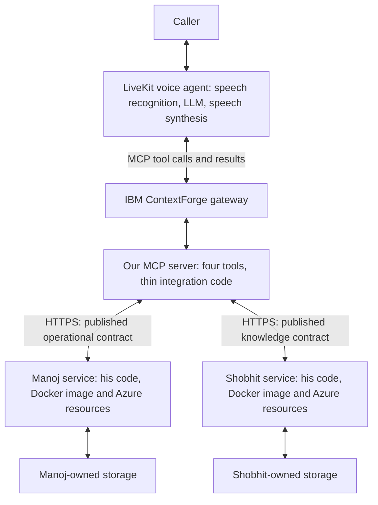

# Target ownership, cleanup and voice performance

Confirmed 1 October 2026. This document strengthens the [implementation plan](PLAN.md) following the user's handover review. It specifies the required future state; the migration and Azure cleanup have not been executed.

## Architecture and ownership

The source migration removed the repository-owned REST API and database implementation. The contract-only ownership boundary is:

The LLM chooses a tool and arguments; the LiveKit runtime/MCP client executes the request through the gateway. Results return along that path for the voice agent to speak. The call-end lifecycle invokes `record_call_summary` separately from ordinary conversational model selection. The four tools remain `get_doctor_availability`, `manage_booking`, `search_knowledge`, and `record_call_summary`.

**External service dependencies remain; external implementation dependencies must not.** Calling their APIs requires available services, configured URLs and credentials. It must never require their source checkout, database access, migrations, server image, internal Python packages or implementation SDKs. Each owner supplies a versioned Swagger/OpenAPI interface as the integration authority. Required behavior, errors, auth/scopes and replay semantics must be documented there or in explicitly referenced contract documentation; an endpoint list alone does not establish those guarantees.

| Belongs here | Stays outside this repository |
|---|---|
| Our MCP tool definitions, descriptions, input/output validation and small HTTP adapters | Manoj's REST route handlers, booking/scheduling/name/date engines and database models |
| Pinned owner contracts, client-side request/response types, consumer tests and synthetic fixtures | Shobhit's retrieval pipeline, embeddings, vector store, documents, classifiers and clinical rules |
| Authentication, trusted call-context forwarding, deadlines, safe replay handling and honest error mapping | Either team's source repository, Docker image build, deployment or database administration |
| Bounded in-memory caches of allowed directory/profile data and tokens | Operational data persistence, database/Redis requirements, a local booking ledger or knowledge fallback |
| MCP Dockerfile, CI, deployment, gateway registration and relevant observability | Provisioning either owner's cloud resources or retaining a hidden old backend for production fallback |

Generated client types are acceptable if they represent the public interface only. Do not generate server scaffolding. Development stubs are contract fixtures excluded from production, not an alternative scheduling or knowledge implementation. A developer can install, build and run mandatory MCP tests without either owner's source or database. Live integration needs their designated test service or labelled fixture servers.

MCP remains model-independent: there is no second LLM, agent loop, embedding call, database query or local interpretation/retrieval engine inside it. Its small orchestration layer combines the contracted facts needed for one caller request. Only search_knowledge forwards its verbatim question to the knowledge owner. Availability and booking call only Manoj. Voice-agent behaviour, prompts, guardrails and SDK wiring are owned by the voice team.

## Cleanup is part of completion

Code removal alone does not finish this migration. Follow the [Azure inventory and retirement requirements](AZURE-RETIREMENT.md) as well as the plan's source retirement inventory.

Completion requires:

1. External integrations pass consumer and real-service checks; exactly four intended tools are registered with correct lifecycle access.
2. The old backend source, dependency declarations, database/migration/seed tooling, active legacy setup instructions and automation are removed or explicitly historical as appropriate. No active fallback or import can reach them.
3. A clean checkout builds and runs mandatory tests/CI without the old API, database or private workspace files. Required suites must not silently skip. Current legacy defects must have relevant consumer coverage after the old slot semantics are retired.
4. Obsolete Azure API apps/revisions, backend jobs, images, database assets, credentials and access grants are retired after cutover and any required data handoff. Shared resources retain a named owner and purpose, or are separated before removal. Delete an obsolete resource group only after every contained resource is retired or relocated.
5. The final resource inventory identifies what was deleted, what remains and why. Verify the MCP/voice path after cleanup, absence of obsolete references/jobs, applicable retained-data expiry and residual billing. A retention obligation has an owner and expiry; it must not become an undocumented permanent legacy service.
6. Voice performance and failure behavior pass the measured gates below. A successful Docker build alone is insufficient.

The user's requirement includes future cloud cleanup. This documentation update performs only read-only Azure inspection, not deletion or database modification. Before destructive execution, resolve ownership/data retention and prepare the exact scoped retirement list; never infer safe deletion from a resource name.

## Tool contract boundary

[VOICE-TEAM.md](../VOICE-TEAM.md) is the consumer interface: four tools, purpose and applicability,
parameter formats and conditional requirements, output fields, outcome/nextStep meanings, transport,
authentication and trusted headers. Its field tables are tested against the pinned MCP schema.

The adapter retains input validation, confirmed-write requirements, identity/lifecycle authorization,
compact structured results, idempotency and error semantics. Descriptions and server metadata contain
facts only. Prompt design, spoken wording, guardrails, tool-selection strategy and LiveKit integration
are outside this repository. MCP carries no model-specific client or application implementation.

## Two different latency measurements

| Measurement | Boundary | Planning target |
|---|---|---|
| Tool round trip | Agent dispatches tool → gateway → MCP → owner service(s) → result back to agent | Aim around 250 ms: the existing plan allocates 70 ms to gateway/MCP/transport and 180 ms to downstream critical path. Sub-500 ms alone does not prove the caller target. |
| Customer response | Caller finishes speaking → first useful answer is audible to that caller | Proposed p95 ≤1,000 ms under agreed load; a useful sub-500 ms response is desirable but not currently demonstrated. Includes speech endpointing, model/tool selection, tool round trip, response generation, TTS and media delivery. |

These are engineering targets, not measured guarantees or MCP protocol requirements. Use the remaining turn budget to set a single deadline across auth, pool wait, downstream calls and any retry. Do not give each REST call a separate 500 ms allowance. Count timeout/failure rates separately so fast failure is not presented as successful low-latency service. Filler such as “Let me check” is not the useful-answer measurement.

To keep the adapter thin and fast:

- Reuse async HTTP connections and warm tokens; bound request/response sizes and fan-out. Cache only permitted stable directory/profile data, not current board truth or stale knowledge answers.
- Overlap independent Manoj reads. Once the doctor is resolved, profile and board can run together. An appointment write requires caller confirmation and a current board check. Search-dependent reads cannot all be called parallel by assumption.
- Keep the gateway, MCP and owner services close enough in network terms to meet the measured budget. Bound cold-start delays with the chosen hosting setup; include cold starts in reporting.
- Keep summaries and durable retry work after the call in platform infrastructure. Do not add a database/queue backend to MCP or retry long writes during speech turns. Cancelling a local request does not prove a remote appointment was undone.
- Measure the gateway separately and trace the entire LiveKit path. Owner API latency and any knowledge-service LLM work count against the same response budget. If either service is too slow, negotiate placement/contract performance with its owner; do not copy its implementation into MCP or invent local interpretation.

Real-host MCP measurements still require declared concurrency, cold/warm token state and useful
outcomes/failure rates. End-to-end audio measurement belongs to the voice platform. Publishing a tool
contract or passing fixture tests does not establish application safety or the caller-response target.
