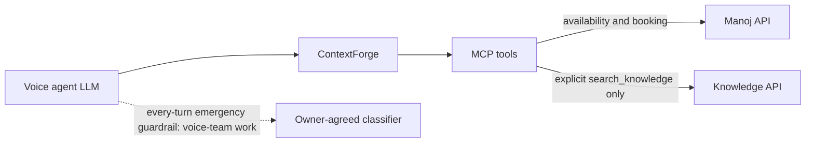

# Scheduling without a hidden knowledge dependency

Date: 2 October 2026. Baseline: `73a083209f2bff7260ac62f2cf93863afe4b36a1`.
Status: implemented and locally verified; not merged, deployed or tested against live owners in this change.

## Approved scope and result

Garima approved removing knowledge checks from availability **and every booking action** after the plan and explanation of `reasonVerbatim`. This supersedes the brief's proposed optional reason check. The reason remains caller wording forwarded where Manoj's contract supports it: CREATE and CANCEL. The existing RESCHEDULE payload does not support a reason.



Availability uses directory, profile and live board reads. Booking preserves identity, caller confirmation, board checks, replay protection and uncertain-write handling. UNKNOWN still means callback details and call summary only. The fourth tool, call-summary recording, and its lifecycle authorization are preserved.

`search_knowledge` now makes one owner request. Its provisional response covers answer, no answer, clarification, desk transfer, emergency transfer and department routing. There is no fallback gate, conditional transcript check or feature flag. An absent knowledge configuration no longer prevents production settings, scheduling or the scheduling smoke test from working. Knowledge itself honestly returns `COULD_NOT_CHECK / NOT_CONFIGURED`.

No production module or dependency was added. The new text artifact exports existing prompt rules for the voice agent. This report and evidence files are new because the brief requires a reviewable hand-back and pasted proof in Git. User-owned `temp/` and the input briefs remain untouched.

## Mandatory checklist and proof index

The raw command output is committed in [routing-removal-evidence](routing-removal-evidence/). Selected output is pasted below. These are local tests, not claims about deployed services.

| Requirement | Result and evidence |
|---|---|
| Zero knowledge calls from availability | PASS: 18-case configured/unconfigured matrix, HTTP transport fails if touched; doctor ID/name, ambiguous name, department ID/name, unknown board, absent target, not found and invalid date. `01-*`, `19-*`. |
| Scheduling works without knowledge configuration | PASS: matrix, production-settings integration test and real-process smoke test. `04-*`, `06-*`, full run. |
| Obsolete implementation removed | PASS for active code, tests, tooling and current operating docs: per-symbol grep in `16-symbol-scan.txt`; final Vulture exit 0 with no findings in `18-final-artifacts.txt`. Historical evidence exception below. |
| Source becomes smaller | PASS: 12 source files, +124 / −355, net **−231 lines**. No new source file. |
| Behavioral tests seen failing | RED→GREEN evidence for every changed behavior in the table below; existing fixture/constructor/header adaptations preserve prior behavioral assertions. Invalid-date and empty-input cases which already passed use mutation proof. Do not interpret this as a separate red run for every mechanically edited existing test. |
| Full verification, snapshot, version | PASS: 358 hermetic tests, 2 process end-to-end tests, lint, wheel/sdist and both images; snapshot and instructions byte-identical; schema version `2026-10-02.1`. |
| Current rules and decisions updated | PASS: CLAUDE, PLAN, TARGET-STATE, DECISIONS and owner handovers updated. |
| Voice handover | PASS as documentation: [LIVEKIT.md](../../LIVEKIT.md), generated [AGENT-INSTRUCTIONS.txt](../AGENT-INSTRUCTIONS.txt); actual voice implementation is outside this repository. |
| Both reviewers | PASS: voice-safety and latency reviewers re-reviewed after fixes; no blocking findings remain. Details below. |
| File-by-file hand-back | Included below, with checks and remaining work. |

**Scope of symbol proof:** the approved plan preserves old review/latency/handoff reports as dated evidence, with prominent superseded notices. Those documents, these proof logs and the user-owned briefs necessarily still quote removed symbols. Thus a literal unrestricted repository grep is **not zero**, and is not claimed to be. Active implementation, tests and current instructions have zero references to the removed symbols. `ROUTING_REQUIRED` remains valid for the explicitly chosen knowledge tool; `_prefetch` remains the operational-read helper. Neither is a leftover scheduling gate.

**Process accounting:** behavioral changes were developed with focused failing tests and focused green runs, followed by integrated fast/full checks. Mechanical fixture and constructor edits were regression-checked, not individually mutation-tested. The ≤10-file commits group the completed, jointly verified change; they are not a claim that each intermediate commit independently builds. This records the actual process rather than claiming every literal process item was separately demonstrated.

## Tests that catch the changed behavior

| Behavior | Failing evidence | Passing evidence |
|---|---|---|
| Availability independent of transcript and knowledge | `01-availability-red.txt`: 16 failures; two invalid-date cases already passed | `01-availability-green.txt`; full run |
| Invalid-date boundary in that matrix | `19-date-boundary-mutation.txt`: accepting an invalid date as today produces two failures | Same file after source restoration: 18 pass |
| Booking with absent, ordinary or red-flag reason, no hidden knowledge call | `02-booking-red.txt`: three failures | `02-booking-green.txt`; full run |
| Single knowledge exchange and all outcomes, exact wire words, schema/error cases | `03-knowledge-red.txt`: 21 failures | `03-knowledge-green.txt`; full run |
| Existing knowledge empty guard, approved routing speech, cancellation/deadline | `13-review-mutations-red.txt`: remove guard/speech or relax deadline, tests fail | `14-final-fast.txt`; full run |
| Production config without knowledge | `04-settings-red.txt`: failure | `04-settings-green.txt`; full run |
| Deploy without unused knowledge secret | `05-deploy-red.txt`: failure | Full run, deploy dry-run suite |
| Smoke distinguishes unavailable knowledge from failed scheduling | `06-smoke-red.txt`; inconsistent-envelope mutation in `13-*` | Full run, process test and boundary fake tests |
| Exported instructions and versioned schema | `07-instructions-red.txt`: two failures | Full run; exact generated artifact comparisons in `18-*` |
| CREATE cancellation cancels both outstanding owner reads | `10-cancellation-red.txt`: board read remains alive | `12-review-fixes-green.txt`; full run |
| Benchmark actually measures a CREATE write | `11-bench-red.txt`; callback-as-success mutation in `13-*` | `12-*`; final benchmark JSON |
| Single-endpoint knowledge stub | Endpoint mutation in `13-*` | Full run; restored fixture checks in `18-*` |

New service tests mock HTTP transports and clocks. New smoke envelope tests fake the remote MCP client boundary. New benchmark tests run a subprocess. Existing test helpers that mock internal functions predate this change and were not expanded. Old gate-specific tests were replaced by the independent-service and single-exchange assertions; identity, board, replay, uncertain-write, privacy and lifecycle assertions remain.

## Independent review and fixes

| Reviewer | Finding | Resolution and evidence |
|---|---|---|
| Latency | CREATE cancellation could leave an owner read running | Await both reads together; cancellation test observes both transports terminate and no write. |
| Latency | Benchmark accepted callback refusal as successful CREATE and used an unsuitable date | Require `NOTED` plus observed `POST /appointments`; date comes from benchmark clock or explicit test-date configuration. Known and UNKNOWN doctors tested. |
| Latency | Benchmark wording implied session initialization was timed | Label explicitly states tools/call after initialization. |
| Latency | Smoke and timeout assertions needed failure coverage | Inconsistent/error MCP envelopes rejected; timeout test verifies actual transport cancellation. |
| Voice safety | Assert exact returned routing speech and decision | Added both assertions; removing speech fails the mutation check. |
| Both | Voice work must not be presented as implemented here | Handover describes proposed work, tests, cancellation/stale-result rules and pre-write guardrail barrier explicitly. |

Re-review: voice-safety reviewer reported **202 passed** and no blocking findings; latency reviewer reported **115 passed** plus the focused smoke test, no unresolved findings. Their independent fixture benchmark also passed 70/70. The separately saved hand-back benchmark is the evidence used below. Reviewers made no Azure changes.

## Latency: measured boundary and limits

[17-bench-stubs.json](routing-removal-evidence/17-bench-stubs.json) records 10 samples per scenario, concurrency 1: **70/70 intended outcomes with required owner calls observed, zero failures, zero samples over 300 ms**. Local TCP MCP calls with in-process owner stubs; token warmed; initialization outside the timer. Diagnostic deadlines apply to the benchmark. This is not a controlled before/after comparison or production latency proof.

| Scenario | p50 ms | p95 ms |
|---|---:|---:|
| Known doctor | 24.5 | 36.8 |
| Doctor name | 25.4 | 59.1 |
| Ambiguous doctor | 24.1 | 27.4 |
| Department | 25.0 | 28.5 |
| Knowledge answer | 13.8 | 18.0 |
| Booking LIST | 15.3 | 23.7 |
| Booking CREATE | 16.5 | 28.0 |

No extra scheduling network hop remains. Independent owner reads still overlap. Real owner latency, ContextForge overhead, STT, LLM and TTS remain outside this evidence; the complete one-second caller-response target requires a deployed voice-path measurement.

## What remains before production rollout

1. **Shobhit:** agree the proposed single-request knowledge contract and provide its host/authentication. The classifier API for the voice guardrail also needs an owner-agreed contract; do not assume it is this answer endpoint.
2. **Voice team:** implement the every-turn emergency guardrail, stale-result/cancellation behavior, and barrier before booking writes; inject the generated instructions, configure the three conversational tools and retain the lifecycle call for summaries. Validate actual SDK behavior and the acceptance scenarios in LIVEKIT.md. No voice test is claimed executed in this repo.
3. **Agreement before merge/cutover:** the input brief requires Shobhit/voice-team agreement on the safety-rule change and explicit acceptance of the gap by Garima, Shobhit and the clinical owner. Garima approved the implementation direction; other owners' acceptance has not been invented. Without the external guardrail, MCP does not itself detect emergencies in availability or booking, including a reason containing danger signs.
4. **Gateway and release:** refresh discovered tool schemas/descriptions and explicitly verify instruction injection. Deploy and run external smoke/owner journeys only after release authorization and the agreement above. No Azure resource or database was modified here.
5. **Manoj dependencies:** previous scope, board-data and synthetic-tenant findings remain in OPEN-DEPENDENCIES; this local change did not re-probe them and does not claim their current live status. Scheduling independence does not grant a missing API scope or create owner test data.

Optional relative-date expansion was not included. Dates remain `today` or an explicit confirmed ISO date.

## File-by-file changes and verification

Paths below are relative to repository root. `full` means the captured `./scripts/test.sh` run; `schema` and `instructions` mean the exact comparisons in evidence 18. External tests were updated but not executed against owner services.

| File | Change | Verification |
|---|---|---|
| `services/mcp/src/frontdesk_mcp/availability.py` | Remove hidden knowledge gate and route-derived department; preserve parallel owner reads | availability matrix, existing board/directory tests, full |
| `services/mcp/src/frontdesk_mcp/booking.py` | Remove all reason/transcript gates; cancellation owns both reads | reason journey, cancellation, booking regressions, full |
| `services/mcp/src/frontdesk_mcp/tools.py` | Build scheduling services without knowledge dependency | server journey, full |
| `services/mcp/src/frontdesk_mcp/outcomes.py` | Remove obsolete scheduling fields/outcomes; keep explicit knowledge decisions | schema, service suites |
| `services/mcp/src/frontdesk_mcp/knowledge.py` | One request and exhaustive owner-outcome mapping | knowledge suite, mutations, full |
| `services/mcp/src/frontdesk_mcp/knowledge_client.py` | Remove old routing endpoint/client path and transcript echo | wire facts, deadline/privacy/failure tests |
| `services/mcp/src/frontdesk_mcp/knowledge_contract.py` | Single provisional answer contract with routing outcomes and validation | malformed/boundary knowledge tests |
| `services/mcp/src/frontdesk_mcp/context.py` | Delete transcript parser; preserve identity/principal/timing headers | context, server auth, booking and summary tests |
| `services/mcp/src/frontdesk_mcp/config.py` | Permit absent knowledge host; validate configured production hosts | settings and production-no-knowledge test |
| `services/mcp/src/frontdesk_mcp/cli.py` | Export existing agent rules without credentials | instructions CLI test and comparison |
| `services/mcp/src/frontdesk_mcp/prompt.py` | Updated rules, explicit voice responsibility, schema version | instructions tests, schema |
| `services/mcp/src/frontdesk_mcp/packs/healthcare.json` | Clear tool selection and critical speaking rules | pack tests, schema, reviewer inspection |
| `services/mcp/tests/test_availability.py` | Replace obsolete gates with independence matrix | 01, 19, full |
| `services/mcp/tests/test_booking.py` | Reason-forwarding/no-knowledge journey and cancellation; adapt constructors | 02, 10, 12, full |
| `services/mcp/tests/test_knowledge.py` | Single-exchange outcomes, wire facts, failures, privacy, deadlines | 03, 13, full |
| `services/mcp/tests/test_context.py` | Remove obsolete transcript assertions; retain identity/timing assertions | full |
| `services/mcp/tests/harness.py` | Remove obsolete transcript fixture fields; retain HTTP boundary harness | full |
| `services/mcp/tests/test_summary.py` | Remove unused transcript fixture field | summary suite, full |
| `services/mcp/tests/test_gate_assertions.py` | Constructor adaptation and generic unknown-outcome refusal | full |
| `services/mcp/tests/test_e2e_processes.py` | Transcript-free process journey and smoke | 2 process tests |
| `services/mcp/tests/test_external.py` | Scheduling tests independent of knowledge host/header | collected in full; owner execution pending |
| `services/mcp/tests/test_external_transport.py` | Remove obsolete header from deployed-adapter test | collected; deployed execution pending |
| `services/mcp/tests/test_settings.py` | Production scheduling with unconfigured knowledge | 04, full |
| `services/mcp/tests/test_deploy.py` | Optional secret dry run and smoke failure envelopes | 05, 13, full |
| `services/mcp/tests/test_server.py` | Updated instructions/schema, transcript-free journey, no-knowledge smoke and export | 06, 07, full |
| `services/mcp/tests/test_stubs.py` | Single knowledge endpoint and all fixture outcomes | 13, full |
| `services/mcp/tests/test_bench.py` | Subprocess proof of real CREATE versus callback refusal | 11, 13, full |
| `services/mcp/tests/contracts/mcp-tools.snapshot.json` | Regenerated public schemas and descriptions | schema exact comparison |
| `services/mcp/dev/frontdesk_stubs/knowledge.py` | Delete parallel routing stub and state | stub tests and process tests |
| `services/mcp/dev/frontdesk_stubs/data/demo_hospital.json` | Consolidated answer/decision fixtures, operational fixtures preserved | stub/availability tests |
| `services/mcp/dev/bench.py` | Remove routing setup; correct date, outcome, observed-write and timing claims | subprocess tests, benchmark JSON |
| `services/mcp/dev/demo.py` | Explicit knowledge demonstration | lint; same fixture outcomes covered in stub tests |
| `deploy/azure/deploy.sh` | Optional knowledge secret/URL, clear unused bearer env | dry-run tests; no deployment |
| `deploy/azure/smoke.py` | Honest unconfigured-knowledge smoke, no transcript header, specific exceptions | real local MCP smoke and error-envelope tests |
| `deploy/contextforge/register.py` | Remove obsolete transcript passthrough | full deploy/registration tests |
| `Makefile` | Generated `agent-instructions` target | CLI test and artifact comparison |
| `.claude/agents/voice-safety-reviewer.md` | Review the new safety boundary and retained protections | reviewer used current rules |
| `.claude/agents/latency-reviewer.md` | Review explicit knowledge and owner-only scheduling | reviewer used current rules |
| `CLAUDE.md` | Replace old gate invariant | symbol scan, reviewer inspection |
| `.env.example` | Explain optional knowledge configuration | settings/deploy checks |
| `README.md` | Scheduling independence and instruction generation | command checks, doc review |
| `services/mcp/README.md` | Updated tools, optional knowledge and schema behavior | schema/instructions comparison |
| `deploy/environments/README.md` | Optional knowledge deployment behavior | deploy dry-run checks |
| `docs/DECISIONS.md` | K1 context, alternatives, approved decision, risks and owner gates | reviewed against brief and actual code |
| `docs/architecture/TARGET.md` | Current knowledge and voice responsibility | symbol scan, code comparison |
| `docs/handover/LIVEKIT.md` | Verified SDK wiring, explicit prompt injection, every-turn guardrail design/tests | official docs/source checked; voice execution pending |
| `docs/handover/VOICE-TEAM.md` | Replace transcript requirement with external guardrail/instructions | reviewer inspection |
| `docs/handover/CONTEXTFORGE.md` | Revised passthrough/instruction responsibilities | registration code comparison |
| `docs/handover/OWNER-INTEGRATION-MESSAGES.md` | Updated knowledge/voice asks | contract and handover comparison; not sent |
| `docs/handover/mcp-only/PLAN.md` | Replace old gate plan, sequence and acceptance requirements | symbol scan, code comparison |
| `docs/handover/mcp-only/TARGET-STATE.md` | Correct dependency and safety ownership | symbol scan, code comparison |
| `docs/handover/mcp-only/AGENT-INSTRUCTIONS.txt` | Generated, versioned rollout-specific injection artifact | byte-identical regeneration |
| `docs/handover/mcp-only/implementation/OPEN-DEPENDENCIES.md` | Distinguish owner/voice work from MCP scheduling readiness | code comparison; live status not rechecked |
| `docs/handover/mcp-only/FABLE-MASTER-PROMPT.md` | Mark historical gate instructions superseded | manual notice/link check |
| `docs/handover/mcp-only/implementation/REVIEW-REPORT.md` | Mark old review historical and link this report | manual notice/link check |
| `docs/handover/mcp-only/implementation/LATENCY-RESULTS.md` | Mark historical measurements, link current boundary evidence | manual notice/link check |
| `docs/handover/mcp-only/implementation/NEXT-AGENT-HANDOFF-20261002.md` | Mark old gate handoff superseded | manual notice/link check |
| This report | Approval, proof, file map, limits and next-owner work | captured evidence and both reviewer results |
| `implementation/routing-removal-evidence/*` | Raw red/green, mutation, full-run, scan and benchmark proof | actual command output; fixtures only, no owner credentials |

## Pasted command proof

The following excerpts are copied from the captured logs; complete logs remain alongside this report.

```text

$ captured: 01-availability-green.txt
60 passed, 2 warnings in 1.79s

$ captured: 01-availability-red.txt
16 failed, 2 passed, 42 deselected, 2 warnings in 1.15s

$ captured: 02-booking-green.txt
60 passed, 2 warnings in 1.96s

$ captured: 02-booking-red.txt
3 failed, 62 deselected, 2 warnings in 0.75s

$ captured: 03-knowledge-green.txt
24 passed, 2 warnings in 1.05s

$ captured: 03-knowledge-red.txt
21 failed, 3 passed, 2 warnings in 1.24s

$ captured: 04-settings-green.txt
36 passed, 2 warnings in 0.71s

$ captured: 04-settings-red.txt
1 failed, 21 deselected, 2 warnings in 0.89s

$ captured: 05-deploy-red.txt
1 failed, 20 deselected, 2 warnings in 1.06s

$ captured: 06-smoke-red.txt
1 failed, 16 deselected, 2 warnings in 1.38s

$ captured: 07-instructions-red.txt
2 failed, 16 deselected, 2 warnings in 1.05s

$ captured: 08-test-fast.txt
352 passed, 11 deselected, 2 warnings in 20.24s

$ captured: 10-cancellation-red.txt
1 failed, 60 deselected, 2 warnings in 1.21s

$ captured: 11-bench-red.txt
1 failed, 4 deselected, 2 warnings in 2.32s

$ captured: 12-review-fixes-green.txt
66 passed, 2 warnings in 3.64s

$ captured: 13-review-mutations-red.txt
MUTATION: knowledge empty-input guard
3 failed, 21 deselected, 2 warnings in 1.07s
EXIT: 1
MUTATION: knowledge approved routing speech
1 failed, 5 passed, 18 deselected, 2 warnings in 0.72s
EXIT: 1
MUTATION: knowledge deadline cap
1 failed, 13 passed, 10 deselected, 2 warnings in 1.78s
EXIT: 1
MUTATION: smoke inconsistent knowledge envelope
3 failed, 21 deselected, 2 warnings in 0.71s
EXIT: 1
MUTATION: bench refuses callback as write success
2 failed, 4 deselected, 2 warnings in 3.48s
EXIT: 1
MUTATION: knowledge stub single endpoint
4 failed, 10 deselected in 0.25s
EXIT: 1

$ captured: 14-final-fast.txt
358 passed, 11 deselected, 2 warnings in 23.28s

$ captured: 15-full-reviewer-run.txt
== install (frozen)
== lint
== hermetic suites
358 passed, 11 deselected, 2 warnings in 35.76s
== process e2e (stubs + adapter over TCP)
2 passed, 367 deselected, 2 warnings in 3.89s
== package build
Successfully built /tmp/frontdesk-mcp-build/frontdesk_mcp-0.1.0.tar.gz
Successfully built /tmp/frontdesk-mcp-build/frontdesk_mcp-0.1.0-py3-none-any.whl
== production image build (no stubs, no fixtures, no dev dependencies)
== development stubs image build (compose profile stubs)
== external gates not run: no profile loaded (scripts/run-profile.sh mock|live -- ./scripts/test.sh)
== all suites passed

$ captured: 19-date-boundary-mutation.txt
MUTATION: accept invalid date as today; new matrix boundary must reject it.
2 failed, 16 passed, 42 deselected, 2 warnings in 0.90s
SOURCE RESTORED
18 passed, 42 deselected, 2 warnings in 0.67s

$ uvx vulture services/mcp/src --min-confidence 80
exit 0
$ make schema | compare with services/mcp/tests/contracts/mcp-tools.snapshot.json
exit 0: byte-identical
$ make agent-instructions | compare with docs/handover/mcp-only/AGENT-INSTRUCTIONS.txt
exit 0: byte-identical
$ git diff --check
exit 0

$ grep -rnIw <symbol> <active roots enumerated in 16-symbol-scan.txt>
_Routing: exit 1: zero active hits
_routing_outcome: exit 1: zero active hits
_routing_out: exit 1: zero active hits
routing_task: exit 1: zero active hits
RouteRequest: exit 1: zero active hits
RouteResponse: exit 1: zero active hits
CLEARANCE: exit 1: zero active hits
additionalText: exit 1: zero active hits
TurnEcho: exit 1: zero active hits
TurnContext: exit 1: zero active hits
TurnFailure: exit 1: zero active hits
UTTERANCE_MAX: exit 1: zero active hits
_turn: exit 1: zero active hits
X-Turn-Context: exit 1: zero active hits
ROUTING_UNAVAILABLE: exit 1: zero active hits
ASK_ROUTING_CLARIFICATION: exit 1: zero active hits
ROUTE_PATH: exit 1: zero active hits

$ git diff --stat 73a0832 -- services/mcp/src
 12 files changed, 124 insertions(+), 355 deletions(-)
SOURCE TOTAL: +124 -355; net -231
```

The two Authlib deprecation warnings come from installed dependencies; no production dependency was changed. External suites were deliberately not executed or marked as passed.
